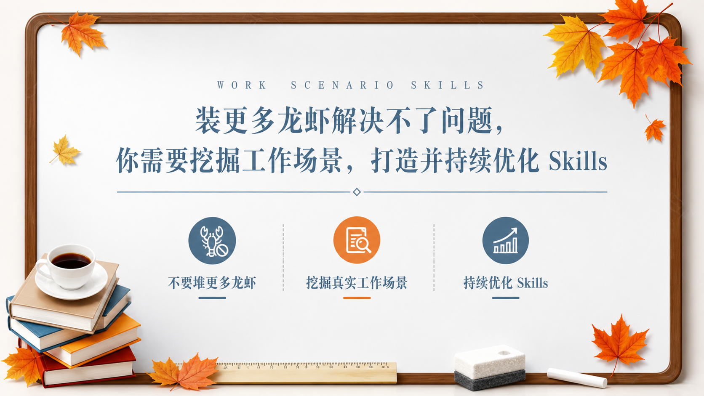

# 秋日校园答辩 PPT

把用户的新内容转成一张秋日校园毕业答辩模板气质的 16:9 横版 PPT 图片，并默认调用 `imagegen` skill / 内置 `image_gen` 工具生成图片。

## 效果预览



`assets/preview.png` 是创建本 Skill 时用户确认满意的 16:9 样图，用于展示目标视觉风格。后续生成新图片时，不必复制预览图内容，只复用它对应的视觉系统、版式语言和信息组织方式。

## 默认设置

- **比例**：16:9 横版。
- **生图方式**：使用 `imagegen` skill，底层调用内置 `image_gen` 工具。
- **背景**：浅灰到白色渐变纸面、干净白板或讲义页质感，可有轻微阴影和柔和纸张层次。
- **主色**：蓝灰色文字、深棕木质边框、橙黄和橘红枫叶点缀，少量黑灰辅助文字。
- **画风**：简约时尚毕业答辩 PPT、校园学术报告模板、秋日书桌与白板、低密度信息图。
- **文字**：中文短标题、稀疏大写英文字距装饰、少量副标题和模块说明；避免密集小字。
- **默认交付**：用户要图片、出图、配图、PPT 图、演示页时，整理最终提示词并调用 `image_gen`；用户明确只要提示词时，不调用图片生成。

## 适用场景

- 毕业答辩、论文开题、学术汇报、课程报告、读书分享、校园主题演讲。
- 封面页、目录页、章节过渡页、研究框架页、方法步骤页、观点拆解页。
- 需要“秋日”“校园”“书本咖啡”“木质边框”“蓝灰学术模板”“简约答辩 PPT”等视觉气质的横版信息图。
- 用户希望把新主题、新文案或新结构生成同款 PPT 风格图，而不是重画参考图。

## 风格规范

### 画幅与留白

- 默认 16:9 横版，画面中心是一张干净的白板、纸面或讲义页，四周保留明显留白。
- 主体内容通常占画面中部 65% 到 82% 宽度，边缘留给木框、枫叶和学习物件。
- 信息密度偏低到中等，适合标题、目录、3 到 5 个观点模块、中心放射或简洁流程，不做满屏表格。
- 底部和角落可以承载装饰物，但装饰不能遮挡标题、模块文字或重要图标。

### 背景与质感

- 背景以浅灰、白色、极淡蓝灰渐变为主，像 PPT 白板、讲义纸面或安静桌面上的展示页。
- 外圈常使用深棕色木质圆角边框，带轻微纹理、内侧细线和柔和投影，形成“框住的演示页”感觉。
- 可以加入薄阴影、浅色内边线、轻微纸张明暗变化；不要做成强烈玻璃拟态、暗黑科技或厚重复古海报。

### 配色系统

- 蓝灰色用于主标题、英文装饰字、细横线、目录编号、线性图标和部分模块标题。
- 深棕色用于木质边框、局部阴影和桌面感承托。
- 橙黄、金黄、橘红用于枫叶、关键圆点、强调图标和少量重点文字。
- 黑灰色只用于简短正文和辅助说明，避免全页变成黑色文字稿。
- 全页色彩应清爽、温和、有秋日感，强调色面积要小而集中。

### 版式结构

整体风格固定为秋日校园答辩 PPT，但版式必须根据用户内容智能选择，不要机械套用单一模板。常见结构包括：

- **封面式**：适合主题句、课程标题、报告标题或一句核心观点，用居中大标题、细线、副标题和底部信息构成。
- **目录式**：适合 4 到 6 个章节或步骤，标题区偏左或居中，右侧或中部用编号列表和细虚线分隔。
- **中心放射式**：适合一个核心概念拆出若干能力、问题、方法或要素，中间放电脑、平板、书本或简洁图标，周围布置模块。
- **左右对比式**：适合问题与解决方案、旧做法与新方法、前后变化，用左右两组模块形成对照。
- **分层说明式**：适合研究框架、方法论、学习路径或执行计划，用横向或纵向层级表达。

模块数量、标题位置、装饰分布、图标选择和重点强调方式都随内容变化；只要保持浅灰白纸面、木质圆角框、秋日枫叶、书本咖啡、蓝灰衬线标题、细线分隔和简约学术气质即可。

### 图形语言

- 使用深棕木质圆角框、蓝灰细线、稀疏英文小字、简洁编号、线性图标、圆形图标节点和细虚线分隔。
- 装饰物可以包括枫叶、书本叠放、咖啡杯、直尺、粉笔擦、铅笔、简单电脑屏幕或平板图标。
- 图标以蓝灰和橙色为主，线条统一、轮廓清楚，不要混用多套图标风格。
- 可使用少量照片质感或拟真物件来营造桌面学习氛围，但主体仍是 PPT 信息图，不是摄影海报。
- 卡片和模块尽量轻量，可用圆点、线条、图标和短标签表达，不依赖厚重阴影卡片。

### 文字层级

- 主标题建议 6 到 18 个中文字符，使用优雅宋体、仿宋、细衬线或高对比中文标题风，颜色为蓝灰。
- 主标题上方可以放一行稀疏大写英文小字，用作氛围装饰，例如 REPORT、STUDY NOTES、SKILL METHOD，但不要喧宾夺主。
- 副标题或核心句建议 12 到 32 个中文字符，可用蓝灰细线承接。
- 模块标题建议 2 到 8 个字，正文说明控制在一行或两行短句。
- 中文必须清晰可读，不能乱码、变形、重叠或被枫叶、书本、边框遮挡。

### 避免项

- 不要复刻参考图原文、Logo、水印、学校标识、真实人物、真实导师姓名、二维码或不确定授权的素材。
- 不要强制每页都有封面居中标题、固定 5 个目录项、固定 6 个圆形图标或固定角落枫叶位置。
- 不要做成商业促销海报、儿童卡通、浓重复古牛皮纸、暗黑科技风、国潮风或复杂论文全文页。
- 不要使用密集小字、复杂表格、厚重卡片堆叠、强烈渐变、过多照片拼贴或夸张 3D 场景。

## 灵活排版原则

- 根据用户输入的段落结构智能选择版式：封面、目录、中心放射、左右对比、上下分层、流程步骤、时间线或观点拆解都可以，只要保持本 Skill 的视觉风格一致。
- 模块数量、标题位置、图标选择、装饰物分布和重点强调方式都可随内容变化；不要机械复制预览图布局。
- 优先保持配色、留白、文字层级、木框纸面质感、秋日装饰和信息密度的一致性。

## Core Workflow

### Step 1：提炼内容

把用户输入压缩成适合一张秋日校园答辩 PPT 表达的信息：

- 一个短主标题，优先概括主题、报告名称或核心观点。
- 一个 12 到 32 字的副标题或核心句；如果画面不需要，可以省略。
- 2 到 6 个主要模块、章节、步骤、维度或结论，数量由内容复杂度决定。
- 每个模块保留一个短标题和一条短说明，避免把文章原文整段搬入画面。
- 如果用户给的是论文、报告或课程内容，先提炼成目录、研究框架、方法步骤或结论亮点。

### Step 2：智能选择版式

根据内容结构选择最合适的 PPT 页面类型：

1. **封面页**：适合标题、主题句、课程名、报告名和一句核心观点。
2. **目录页**：适合章节列表、课程大纲、汇报结构和计划安排。
3. **中心放射页**：适合核心概念拆解、能力模型、问题归因和方法框架。
4. **左右对比页**：适合问题与方案、过去与现在、误区与正解。
5. **分层流程页**：适合研究路径、学习路径、项目步骤和优化闭环。

不要为了贴合预览图而强行固定为某一种结构；优先保证当前内容最清楚，同时保持秋日校园答辩视觉系统。

### Step 3：组织 imagegen 提示词

提示词顺序：

1. 明确图片类型与比例：16:9 横版秋日校园答辩 PPT 信息图。
2. 描述视觉风格：浅灰白纸面、深棕木质圆角边框、秋日枫叶、书本咖啡、蓝灰衬线标题、细线分隔。
3. 描述内容结构：主标题、核心句、模块数量、版式类型、图标或节点层级。
4. 限制文字：中文短标题、短标签、少量说明、清晰可读、不要密集小字。
5. 加负面约束：不要 Logo、水印、学校标识、真实人物、参考图原文、乱码、拥挤排版。

### Step 4：调用 imagegen

- 用户明确要图片、出图、配图、PPT 图、画一张时，使用最终提示词调用 `image_gen`。
- 用户明确说“只给提示词”时，只输出完整提示词，不调用图片生成。
- 生成系列图时，保持同一套浅灰白纸面、深棕木框、蓝灰文字、秋日枫叶、书本咖啡和简约学术信息图气质。

## Prompt Template

```text
请生成一张 16:9 横版 PPT 风格图片，风格为“秋日校园答辩 PPT”。

主题：[用户主题]
主标题：[6 到 18 字中文标题]
副标题或核心句：[12 到 32 字中文短句，可按内容省略]

画面结构：
- 根据内容选择 [封面页 / 目录页 / 中心放射页 / 左右对比页 / 分层流程页 / 时间线页]，不要机械复制预览图布局。
- 主要模块：[模块 1]、[模块 2]、[模块 3]、[按内容增减到 2 到 6 个]。
- 重点表达：[需要突出的核心观点、章节结构、关键步骤、研究框架或结论]。
- 连接关系：[细线分隔 / 编号目录 / 圆形图标节点 / 中心概念 + 周围模块 / 左右对比 / 分层流程]，按当前内容决定。

主要内容：
- [模块 1]：[短说明]
- [模块 2]：[短说明]
- [模块 3]：[短说明]
- [更多模块按内容决定，不要强行填满]

视觉要求：浅灰到白色渐变的干净纸面或白板背景；画面外圈有深棕色木质圆角边框，带轻微纹理、内侧细线和柔和投影；角落和边缘点缀秋日枫叶，颜色为橙黄、金黄、橘红；底部或角落可以加入书本叠放、咖啡杯、直尺、粉笔擦、铅笔等学习物件，保持轻盈，不遮挡正文；主标题使用蓝灰色优雅宋体、仿宋或细衬线风格，搭配细蓝灰横线和稀疏大写英文装饰字；模块使用蓝灰与橙色线性图标、圆形节点、编号或细虚线分隔；整体像简约时尚的校园毕业答辩 PPT 模板，留白充足，信息密度适中。

文字要求：中文短标题、短标签、少量说明，文字必须清晰可读，不要互相遮挡，不要密集小字，不要乱码；英文装饰字可以使用 REPORT、CONTENT、SKILLS、METHOD 等短词，但不要影响中文可读性。

限制：不要 Logo，不要水印，不要学校标识，不要真实人物，不要导师或答辩人真实姓名，不要二维码，不要版权角色，不要复刻任何参考图原文，不要商业促销海报感，不要暗黑科技风，不要厚重复古牛皮纸风，不要照片拼贴。图片比例必须是 16:9。
```

## 出图规则

- 用户说“生成图片 / 直接出图 / 画一张 / 配图 / PPT 图 / 演示页”时，默认调用 `image_gen`。
- 调用前可以简短整理最终提示词，但不要长篇解释设计过程。
- 如果用户没有给具体主题，先从上下文推断；确实无法推断时，只问一个必要问题。
- 优先保证标题清晰、留白充足、蓝灰文字稳定、木质边框完整和秋日校园答辩气质，再追求装饰效果。
