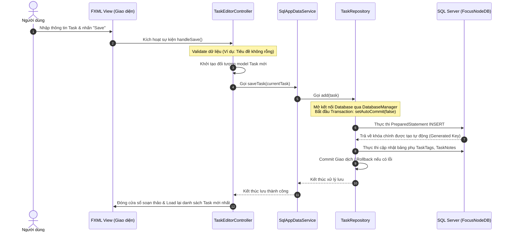

# CẨM NANG ÔN TẬP BẢO VỆ ĐỒ ÁN JAVA - ỨNG DỤNG FOCUS-NODE
*(Phiên bản đầy đủ nhất dành cho kỳ thi bảo vệ Đồ án)*

Tài liệu này được biên soạn chi tiết dựa trên mã nguồn thực tế dự án **Focus-Node** của bạn. Hãy đọc kỹ, hiểu rõ bản chất từng phần để tự tin trả lời bất kỳ câu hỏi nào từ Hội đồng phản biện.

---

## 1. TỔNG QUAN KIẾN TRÚC & CÔNG NGHỆ DỰ ÁN
Khi hội đồng yêu cầu giới thiệu các công nghệ sử dụng trong ứng dụng, hãy trả lời tự tin:
*   **Ngôn ngữ:** Java 21 (Sử dụng tính năng **Virtual Threads** hiện đại để tối ưu hiệu năng chạy bất đồng bộ).
*   **Giao diện (UI):** JavaFX 21 kết hợp với thiết kế bố cục qua file XML cấu trúc (**FXML**), phong cách hiện đại nhờ thư viện giao diện **AtlantaFX** (chủ đề *Primer Light*).
*   **Cơ sở dữ liệu (CSDL):** **SQL Server** (tên DB mặc định là `FocusNodeDB`), sử dụng thư viện **Flyway** để tự động khởi tạo, sửa chữa và nâng cấp cấu trúc bảng (Database Migration) theo phiên bản.
*   **Kiến trúc:** Mô hình **MVC (Model - View - Controller)** kết hợp **Repository Pattern (DAO)** giúp phân tách rõ ràng trách nhiệm giữa giao diện, logic nghiệp vụ và truy xuất dữ liệu.

---

## 2. KIẾN TRÚC MVC VÀ LUỒNG HOẠT ĐỘNG THỰC TẾ
Hội đồng sẽ hỏi: *"Mô hình MVC trong ứng dụng của em được thể hiện ở đâu? Hãy lấy ví dụ về luồng đi của dữ liệu từ khi bấm một nút trên giao diện cho tới khi lưu vào Database?"*

### Cách trả lời về thành phần MVC trong dự án:
1.  **View (Giao diện):** Là các file `.fxml` nằm trong tài nguyên (`src/main/resources/fxml/`). Ví dụ: [TaskEditor.fxml](file:///c:/Users/HunterZ/Desktop/FINAL%20EXAM%20JAVA/src/main/resources/fxml/components/TaskEditor.fxml) hiển thị màn hình soạn thảo nhiệm vụ.
2.  **Controller (Bộ điều khiển):** Là các lớp nằm trong package `com.focusnode.controller`. Ví dụ: [TaskEditorController.java](file:///c:/Users/HunterZ/Desktop/FINAL%20EXAM%20JAVA/src/main/java/com/focusnode/controller/TaskEditorController.java). Lớp này lắng nghe sự kiện từ giao diện, lấy dữ liệu từ các điều khiển (TextField, ComboBox...) và điều phối logic.
3.  **Model (Mô hình dữ liệu):** Là các lớp POJO đại diện cho thực thể CSDL trong package `com.focusnode.model`. Ví dụ: [Task.java](file:///c:/Users/HunterZ/Desktop/FINAL%20EXAM%20JAVA/src/main/java/com/focusnode/model/Task.java) định nghĩa các thuộc tính của một nhiệm vụ.
4.  **Service & DAO/Repository (Tầng dữ liệu phụ trợ):**
    *   **Service Layer ([SqlAppDataService.java](file:///c:/Users/HunterZ/Desktop/FINAL%20EXAM%20JAVA/src/main/java/com/focusnode/service/SqlAppDataService.java)):** Nơi xử lý logic nghiệp vụ nghiệp vụ chung.
    *   **Repository/DAO ([TaskRepository.java](file:///c:/Users/HunterZ/Desktop/FINAL%20EXAM%20JAVA/src/main/java/com/focusnode/repository/TaskRepository.java)):** Thực hiện các truy vấn SQL thô (Select, Insert, Update, Delete) trực tiếp vào SQL Server thông qua kết nối JDBC.

---

### Sơ đồ tuần tự (Sequence Diagram) - Luồng Lưu/Tạo mới một Task:



---

## 3. CƠ SỞ DỮ LIỆU - PHÂN TÍCH SCHEMA (ERD, ERM VÀ CHUẨN 3NF)
Hội đồng sẽ mở file SQL Schema của bạn lên hoặc bắt bạn vẽ sơ đồ thực thể mối quan hệ. Dưới đây là phân tích chi tiết dựa trên file [FocusNode_Schema.sql](file:///c:/Users/HunterZ/Desktop/FINAL%20EXAM%20JAVA/database/FocusNode_Schema.sql):

### 3.1 Cấu trúc thực thể và mối quan hệ (ERM/ERD)
*   **Users (Người dùng) - Bảng gốc độc lập:** Chứa thông tin tài khoản người dùng (`UserId` là PK).
*   **UserSettings (Cài đặt người dùng) - Quan hệ 1-1:**
    *   Mỗi user chỉ có duy nhất một bản cài đặt. Khóa ngoại `UserId` đồng thời là khóa chính (Primary Key kiêm Foreign Key).
*   **Mối quan hệ 1-N (Một - Nhiều):**
    *   `Users` (1) - `Tasks` (N): Một người dùng có nhiều nhiệm vụ. Khóa ngoại: `Tasks.UserId`.
    *   `Users` (1) - `Notes` (N): Một người dùng viết nhiều ghi chú. Khóa ngoại: `Notes.UserId`.
    *   `Users` (1) - `Folders` (N): Một người dùng tạo nhiều thư mục. Khóa ngoại: `Folders.UserId`.
*   **Quan hệ đệ quy (Self-referencing Relationship) - Cực kỳ quan trọng:**
    *   Bảng `Folders` có trường `ParentId` tham chiếu ngược lại đến khóa chính `FolderId` của chính bảng `Folders`.
    *   *Ý nghĩa:* Cho phép thiết kế hệ thống cây thư mục lồng nhau vô hạn (Thư mục con nằm trong thư mục cha).
*   **Mối quan hệ N-N (Nhiều - Nhiều):**
    *   Trong thiết kế CSDL, **không bao giờ liên kết trực tiếp N-N** mà phải tách thành một **bảng trung gian** chứa hai khóa ngoại trỏ về hai bảng chính để tránh vi phạm các dạng chuẩn:
        *   `Tasks` và `Tags` $\rightarrow$ Tách thành bảng trung gian `TaskTags` (`TaskId`, `TagId` ghép lại làm khóa chính phức hợp).
        *   `Notes` và `Tags` $\rightarrow$ Tách thành bảng trung gian `NoteTags` (`NoteId`, `TagId`).
        *   `Tasks` và `Notes` $\rightarrow$ Tách thành bảng trung gian `TaskNotes` (`TaskId`, `NoteId`).
        *   `Notes` và `FileResources` $\rightarrow$ Tách thành bảng trung gian `NoteFiles` (`NoteId`, `FileId`).

### 3.2 Giải thích về thiết kế chuẩn hóa 3NF (Third Normal Form)
Nếu thầy cô hỏi: *"Tại sao CSDL của em đạt chuẩn 3NF?"*, hãy trả lời dựa trên 3 tiêu chí:
1.  **Đạt chuẩn 1NF:** Tất cả các thuộc tính đều là thuộc tính đơn trị (không có mảng, không có danh sách giá trị ngăn cách bởi dấu phẩy nằm trong một ô dữ liệu).
2.  **Đạt chuẩn 2NF:** Đã đạt chuẩn 1NF và tất cả các thuộc tính phi khóa đều phụ thuộc hàm đầy đủ vào khóa chính (không có phụ thuộc một phần khi dùng khóa chính phức hợp).
3.  **Đạt chuẩn 3NF (Quan trọng nhất):** Đã đạt chuẩn 2NF và **không có phụ thuộc bắc cầu** giữa các thuộc tính phi khóa.
    *   *Minh chứng thực tế:* Để quản lý trạng thái (`Status`) và mức độ ưu tiên (`Priority`) của Task, thay vì lưu chuỗi chữ trực tiếp (dễ gây dư thừa và sai chính tả), bạn đã tạo các bảng tra cứu lookup riêng biệt là `TaskStatuses` và `TaskPriorities` rồi liên kết bằng khóa ngoại `StatusId` và `PriorityId`. Thông tin mô tả trạng thái phụ thuộc trực tiếp vào `StatusId` chứ không phụ thuộc bắc cầu qua `TaskId`.

---

## 4. TẦNG DAO (REPOSITORY) & BẢO MẬT TRUY VẤN JDBC
Hội đồng sẽ hỏi rất sâu về cách bạn kết nối CSDL và các lỗ hổng bảo mật liên quan đến SQL.

### 4.1 Phân biệt Statement và PreparedStatement
Xem mã nguồn lớp [TaskRepository.java](file:///c:/Users/HunterZ/Desktop/FINAL%20EXAM%20JAVA/src/main/java/com/focusnode/repository/TaskRepository.java):
*   **Statement:** Được dùng ở hàm `findAll()` để thực thi câu lệnh SQL tĩnh không tham số:
    ```java
    Statement stmt = conn.createStatement();
    ResultSet rs = stmt.executeQuery("SELECT ... FROM dbo.Tasks WHERE IsDeleted = 0");
    ```
*   **PreparedStatement:** Được dùng ở hàm `add()` hoặc `update()` để thực thi câu lệnh SQL động có tham số:
    ```java
    String sql = "INSERT INTO dbo.Tasks(UserId, Title) VALUES(?, ?)";
    PreparedStatement pstmt = conn.prepareStatement(sql);
    pstmt.setInt(1, userId);
    pstmt.setString(2, task.getTitle());
    ```

### 4.2 SQL Injection là gì? PreparedStatement chống lại nó bằng cách nào?
*   **Khái niệm:** **SQL Injection** là kỹ thuật tấn công chèn các ký tự SQL độc hại (ví dụ: `' OR '1'='1`) vào ô nhập liệu của người dùng nhằm thay đổi cấu trúc truy vấn SQL ban đầu, từ đó vượt qua đăng nhập hoặc đánh cắp dữ liệu.
*   **Cơ chế chống của PreparedStatement:**
    *   Khi sử dụng `PreparedStatement`, hệ quản trị CSDL (SQL Server) sẽ **biên dịch trước (pre-compile)** cấu trúc câu lệnh SQL với các tham số giữ chỗ `?`.
    *   Khi bạn truyền dữ liệu vào qua `setString(index, value)`, CSDL chỉ coi toàn bộ chuỗi truyền vào là **giá trị thuần túy (literal value)** chứ không bao giờ biên dịch nó thành lệnh SQL nữa.
    *   Ví dụ: Nếu người dùng nhập vào ô tìm kiếm chuỗi `' OR 1=1 --`, `PreparedStatement` sẽ tìm kiếm chính xác nhiệm vụ có tiêu đề là chuỗi ký tự `' OR 1=1 --` chứ không thực thi điều kiện logic `1=1`. Điều này triệt tiêu hoàn toàn nguy cơ SQL Injection.

### 4.3 Quản lý Giao dịch (Transaction) - ACID trong Repository
Hãy chỉ vào khối lệnh này trong `TaskRepository.add()` để chứng minh bạn có kiến thức sâu về Transaction:
```java
try (Connection conn = DatabaseManager.getConnection()) {
    conn.setAutoCommit(false); // BẮT ĐẦU TRANSACTION (Tắt tự động lưu)
    try {
        // 1. Insert Task vào bảng Tasks
        // 2. Insert các nhãn liên quan vào bảng TaskTags
        // 3. Insert các ghi chú liên quan vào bảng TaskNotes
        
        conn.commit(); // THÀNH CÔNG THÌ LƯU TOÀN BỘ
    } catch (SQLException ex) {
        conn.rollback(); // THẤT BẠI THÌ HỦY TOÀN BỘ (Trở lại trạng thái trước khi thực thi)
        ex.printStackTrace();
    }
}
```
*   **Giải thích:** Nếu quá trình chèn dữ liệu vào bảng `Tasks` thành công nhưng khi chèn vào `TaskTags` bị lỗi kết nối, CSDL sẽ rơi vào trạng thái không nhất quán (Task tồn tại nhưng không có Tag hoặc lỗi nửa chừng). Việc dùng `setAutoCommit(false)` gom tất cả lệnh SQL vào 1 giao dịch duy nhất, đảm bảo tính **Atomicity (Tính nguyên tố)** trong ACID: *Hoặc tất cả cùng thành công, hoặc không có lệnh nào được lưu.*

---

## 5. MẬT KHẨU, THUẬT TOÁN HASH VÀ BẢNG BĂM
Hội đồng sẽ hỏi: *"Mật khẩu của ứng dụng lưu trong Database có an toàn không? Hash hoạt động thế nào? Hãy viết một hàm băm mật khẩu?"*

### 5.1 Phân biệt Băm (Hash) và Mã hóa (Encryption)
*   **Băm (Hashing):** Là thuật toán biến đổi một chuỗi dữ liệu đầu vào thành một chuỗi ký tự có độ dài cố định đại diện cho dữ liệu gốc. Đây là thuật toán **một chiều (one-way)**, nghĩa là chỉ có thể băm từ mật khẩu gốc $\rightarrow$ mã hash, hoàn toàn **không thể dịch ngược** từ mã hash trở lại mật khẩu gốc. Ví dụ: SHA-256, BCrypt.
*   **Mã hóa (Encryption):** Là thuật toán **hai chiều (reversible)**, cho phép biến đổi dữ liệu rõ thành dữ liệu mã hóa bằng một chiếc Khóa (Key), và có thể giải mã ngược lại từ dữ liệu mã hóa thành dữ liệu rõ nếu có Khóa chính xác. Ví dụ: AES, RSA.
*   *Lưu ý bảo mật CSDL:* Mật khẩu người dùng **bắt buộc phải lưu dưới dạng mã băm (Hash)** để tránh việc admin hệ thống hoặc hacker chiếm đoạt DB đọc được mật khẩu rõ.

### 5.2 Bảng băm (Hash Table/HashMap) trong Java hoạt động như thế nào?
Thầy cô hỏi về cấu trúc dữ liệu bảng băm (HashMap):
*   **Cơ chế hoạt động:** HashMap lưu trữ dữ liệu dưới dạng cặp `Key - Value`.
*   Khi gọi `map.put(key, value)` hoặc `map.get(key)`:
    1.  JVM gọi phương thức `hashCode()` của đối tượng Key để tính toán ra một mã băm dạng số nguyên.
    2.  Số nguyên này được ánh xạ (chuyển đổi) thành vị trí chỉ số (index) trong một mảng nội bộ (Buckets).
    3.  **Xử lý đụng độ (Collision):** Nếu hai key khác nhau sinh ra cùng một index:
        *   Trong Java 7 trở về trước: Dùng danh sách liên kết đơn (Chaining).
        *   Từ Java 8 trở đi: Nếu số lượng phần tử bị đụng độ tại một bucket vượt quá ngưỡng (thường là 8), danh sách liên kết sẽ được tự động chuyển đổi thành **Cây đỏ-đen (Red-Black Tree)** nhằm tối ưu hóa thời gian tìm kiếm từ $O(N)$ xuống $O(\log N)$.
*   **Quy ước quan trọng:** Nếu ghi đè (override) phương thức `equals()`, bắt buộc phải ghi đè phương thức `hashCode()`. Hai đối tượng bằng nhau (`equals() == true`) thì **bắt buộc** phải có `hashCode()` giống nhau.

### 5.3 Mã nguồn thực tế để Hash mật khẩu bằng SHA-256 (Hãy chuẩn bị viết lên bảng)
If hội đồng bảo: *"Em hãy viết/cải tiến code để băm mật khẩu bằng SHA-256 trong Java"*, đây là hàm chuẩn sử dụng thư viện sẵn có của JDK không cần thêm JAR ngoài:

```java
import java.security.MessageDigest;
import java.security.NoSuchAlgorithmException;

public class SecurityUtil {
    public static String hashPassword(String password) {
        try {
            // 1. Tạo đối tượng MessageDigest với thuật toán SHA-256
            MessageDigest md = MessageDigest.getInstance("SHA-256");
            
            // 2. Thực hiện băm chuỗi mật khẩu (chuyển sang mảng byte)
            byte[] hashedBytes = md.digest(password.getBytes());
            
            // 3. Chuyển đổi mảng byte sang chuỗi dạng Hexadecimal (thập lục phân)
            StringBuilder sb = new StringBuilder();
            for (byte b : hashedBytes) {
                sb.append(String.format("%02x", b));
            }
            return sb.toString(); // Trả về chuỗi hash 64 ký tự
        } catch (NoSuchAlgorithmException e) {
            // Xử lý ngoại lệ nếu thuật toán băm không tồn tại trong hệ thống
            throw new RuntimeException("Lỗi thuật toán mã hóa mật khẩu!", e);
        }
    }
}
```

---

## 6. GIẢI THÍCH CHI TIẾT "CHỮ E ĐƠN LẺ" VÀ CÁC CẤU TRÚC TRY-CATCH
Hội đồng sẽ chỉ vào code và hỏi: *"Chữ e ở đây nghĩa là gì? Có tác dụng gì?"*

### 6.1 Chữ `e` trong khối Catch: `catch (SQLException e)`
```java
} catch (SQLException e) {
    e.printStackTrace(); // Gọi phương thức của e
}
```
*   **Ý nghĩa:** `e` là một **tham chiếu đối tượng (object reference)** trỏ tới một thể hiện cụ thể của lớp Exception (ở đây là lớp `SQLException` hoặc con của nó).
*   **Nhiệm vụ:**
    *   Lưu trữ toàn bộ thông tin chi tiết về lỗi xảy ra: Thông điệp lỗi (`e.getMessage()`), mã lỗi SQL (`e.getErrorCode()`), và dấu vết ngăn xếp lỗi (`e.printStackTrace()`).
    *   Cho phép chương trình không bị crash đột ngột mà chuyển hướng xử lý lỗi một cách êm đẹp.

### 6.2 Chữ `e` (hoặc `event`) trong Lambda Expression
Bạn sẽ thấy đoạn code này trong dự án:
```java
primaryStage.setOnCloseRequest(event -> ServiceLocator.shutdown());
// Hoặc trong các listener:
searchField.textProperty().addListener((observable, oldValue, newValue) -> filterTaskList(newValue));
```
*   **Ý nghĩa:** `event`, `observable`, `oldValue`, `newValue` là các **tham số đầu vào (parameters)** của một hàm ẩn danh (Lambda Expression) được truyền cho một **Functional Interface**.
*   **Cơ chế hoạt động:**
    *   Trình biên dịch Java tự động suy luận kiểu dữ liệu (Type Inference) của các biến này dựa trên Interface tương ứng.
    *   Ví dụ: `event` trong `setOnCloseRequest` tự động có kiểu là `WindowEvent`. Nó chứa thông tin về hành động đóng cửa sổ của người dùng.

### 6.3 Hướng dẫn bọc Try-Catch-Finally chuẩn (Thầy cô hay bắt sửa code)
Nếu hội đồng yêu cầu bọc try-catch hoặc viết lại phần đóng kết nối thủ công để tránh rò rỉ bộ nhớ (Resource Leak), hãy nhớ **Try-with-resources** (tính năng từ Java 7 trở đi mà dự án bạn đang dùng):
*   *Cách viết cũ (Nguy hiểm vì dễ rò rỉ nếu quên đóng kết nối):*
    ```java
    Connection conn = null;
    try {
        conn = DatabaseManager.getConnection();
        // thực thi SQL
    } catch (SQLException e) {
        e.printStackTrace();
    } finally {
        if (conn != null) conn.close(); // Phải đóng thủ công trong finally
    }
    ```
*   *Cách viết mới (Try-with-resources - Dự án của bạn đang dùng):*
    ```java
    try (Connection conn = DatabaseManager.getConnection();
         PreparedStatement pstmt = conn.prepareStatement(sql)) {
        // Thực thi SQL tại đây
    } catch (SQLException e) {
        e.printStackTrace();
    } // conn và pstmt tự động đóng khi ra khỏi khối try, kể cả khi có ngoại lệ xảy ra!
    ```
    *Giải thích:* Bất kỳ lớp nào triển khai interface `AutoCloseable` đều có thể khai báo bên trong dấu ngoặc đơn `try (...)` và sẽ được tự động giải phóng tài nguyên.

---

## 7. JAVA 21 VIRTUAL THREADS VÀ BẤT ĐỒNG BỘ TRÊN UI
Hệ thống của bạn có lớp [AsyncExecutor.java](file:///c:/Users/HunterZ/Desktop/FINAL%20EXAM%20JAVA/src/main/java/com/focusnode/util/AsyncExecutor.java) sử dụng `Executors.newVirtualThreadPerTaskExecutor()`. Đây là điểm cực kỳ đáng tiền!

### 7.1 Tại sao phải thực thi tác vụ Database bất đồng bộ (Asynchronous)?
*   **Lý do:** JavaFX (và hầu hết các thư viện UI khác) hoạt động trên một luồng chính duy nhất gọi là **JavaFX Application Thread (UI Thread)**. Luồng này chịu trách nhiệm vẽ giao diện, xử lý sự kiện click chuột, cuộn màn hình.
*   Nếu bạn chạy một câu lệnh SQL Server tốn khoảng 2-3 giây trực tiếp trên UI Thread, **giao diện ứng dụng sẽ bị đóng băng (đơ)**, người dùng không thể bấm bất kỳ nút nào khác và Windows sẽ báo "Not Responding".
*   **Giải pháp:** Đẩy việc kết nối và truy vấn CSDL sang một luồng phụ (Worker Thread) thông qua `AsyncExecutor`.

### 7.2 Cơ chế Virtual Threads (Luồng ảo) trong Java 21 là gì?
*   **Luồng truyền thống (Platform Thread):** Liên kết trực tiếp 1-1 với luồng của Hệ điều hành (OS Thread). Số lượng luồng này bị giới hạn (thường vài trăm đến vài nghìn) vì chiếm dụng rất nhiều tài nguyên bộ nhớ (khoảng 1MB cho mỗi stack luồng).
*   **Luồng ảo (Virtual Thread):** Là các luồng cực kỳ nhẹ được quản lý bởi máy ảo Java (JVM) thay vì Hệ điều hành. Nhiều luồng ảo có thể chạy chung trên một luồng nền tảng vật lý.
*   *Ưu điểm vượt trội:* Bạn có thể tạo hàng triệu luồng ảo đồng thời mà không sợ tràn bộ nhớ. Khi luồng ảo gặp thao tác chờ (Blocking I/O như kết nối Database), JVM sẽ tạm treo luồng ảo đó đi để xử lý luồng ảo khác và gắn lại khi có dữ liệu. Điều này giúp ứng dụng FocusNode của bạn có khả năng chịu tải cực kỳ tốt khi thực hiện các tác vụ mạng hoặc CSDL.

### 7.3 Giải thích phương thức Platform.runLater()
Trong lớp [TaskEditorController.java](file:///c:/Users/HunterZ/Desktop/FINAL%20EXAM%20JAVA/src/main/java/com/focusnode/controller/TaskEditorController.java), bạn sẽ thấy đoạn code:
```java
ServiceLocator.getAsyncExecutor().execute(() -> {
    List<Note> notes = ServiceLocator.getAppDataService().getNotes(); // Chạy trên luồng ảo phụ
    Platform.runLater(() -> {
        linkedNoteComboBox.setItems(FXCollections.observableArrayList(notes)); // Chạy trên UI Thread chính
    });
});
```
*   **Tại sao phải dùng `Platform.runLater()`?**
    *   *Nguyên tắc bất di bất dịch của JavaFX:* **Chỉ có JavaFX Application Thread mới được phép cập nhật hoặc thay đổi các phần tử giao diện (UI Components)**.
    *   Tác vụ lấy danh sách ghi chú từ DB được đẩy xuống luồng ảo phụ để tránh đơ UI. Khi đã lấy được danh sách `notes`, luồng phụ không được trực tiếp set dữ liệu vào `linkedNoteComboBox`.
    *   Nó phải gọi `Platform.runLater(Runnable)` để đóng gói công việc cập nhật UI đó và gửi vào hàng đợi của UI Thread chính. UI Thread chính sẽ nhận và cập nhật Combobox một cách an toàn mà không gây lỗi xung đột luồng (`IllegalStateException: Not on FX application thread`).

---

## 8. MAVEN VÀ FILE CẤU HÌNH POM.XML
Hội đồng rất thích chỉ vào file `pom.xml` ở gốc dự án và hỏi về kiến thức quản lý dự án.

### 8.1 Maven là gì? Tại sao phải dùng Maven?
*   **Định nghĩa:** Maven là một công cụ quản lý và xây dựng dự án tự động (Build Tool) dành cho các ứng dụng Java.
*   **Tại sao phải dùng:**
    1.  **Quản lý thư viện phụ thuộc (Dependency Management):** Thay vì phải lên mạng tải thủ công từng file `.jar` (như JDBC, JavaFX, Flyway...) rồi add vào classpath rất dễ lỗi phiên bản, bạn chỉ cần khai báo mã định danh (Group ID, Artifact ID, Version) trong `pom.xml`. Maven sẽ tự động tải thư viện đó về từ kho lưu trữ trung tâm Maven Central.
    2.  **Quản lý vòng đời dự án (Build Lifecycle):** Cung cấp các lệnh tiêu chuẩn để biên dịch (`compile`), dọn dẹp dự án (`clean`), và đóng gói ứng dụng (`package`).

### 8.2 File `dependency-reduced-pom.xml` và `maven-shade-plugin` là gì?
*   **maven-shade-plugin:** Plugin này có nhiệm vụ đóng gói toàn bộ dự án cùng với tất cả các thư viện phụ thuộc (JARs) vào **duy nhất một file JAR lớn** (thường gọi là *Fat JAR* hay *Uber JAR*). Việc này giúp người dùng có thể chạy chương trình ở bất kỳ máy tính nào bằng một lệnh duy nhất: `java -jar focus-node-1.0-SNAPSHOT.jar`.
*   **dependency-reduced-pom.xml:** Khi `maven-shade-plugin` thực hiện đóng gói và gộp các dependency vào JAR chung, nó sẽ tạo ra file `dependency-reduced-pom.xml` này. Nó là một bản sao thu gọn của `pom.xml` gốc, đã loại bỏ các dependency đã được gộp trực tiếp vào JAR để tránh việc các dự án khác khi tham chiếu đến JAR này bị tải trùng lặp thư viện.

---

## 9. CƠ CHẾ DATABASE MIGRATION CỦA FLYWAY
Trong thư mục `src/main/resources/db/migration` của dự án có các file như `V1__Initial_Setup.sql`, `V2__Initial_Data.sql`...

### 9.1 Flyway là gì? Tại sao phải dùng nó?
*   **Khái niệm:** **Flyway** là một công cụ kiểm soát phiên bản cho cơ sở dữ liệu (Database Migration Tool). Nó hoạt động giống như Git nhưng dành riêng cho cấu trúc bảng SQL.
*   **Lý do dùng:** Khi làm việc nhóm hoặc khi deploy ứng dụng lên môi trường khác, việc chạy các câu lệnh SQL tạo bảng bằng tay rất dễ thiếu sót hoặc nhầm lẫn. Flyway tự động hóa hoàn toàn việc này ngay khi ứng dụng khởi động.

### 9.2 Quy tắc đặt tên file Migration của Flyway
Flyway bắt buộc đặt tên file theo quy chuẩn nghiêm ngặt: `V<Version>__<Description>.sql`
1.  Chữ **`V` (viết hoa):** Đại diện cho loại "Versioned Migration" (Phiên bản có thứ tự tăng dần).
2.  Số phiên bản **`Version` (ví dụ `1`, `2`, `3`...):** Để Flyway biết thứ tự thực thi file nào trước, file nào sau.
3.  **Dấu gạch dưới kép `__` (double underscore):** Rất quan trọng, dùng để phân tách số phiên bản và phần mô tả. (Nếu dùng 1 dấu gạch dưới, Flyway sẽ báo lỗi không nhận dạng được).
4.  **Phần mô tả (`Description`):** Mô tả ngắn gọn thay đổi (ví dụ `Initial_Setup`, `Add_Google_Drive_Sync`).
5.  **Đuôi mở rộng:** Phải là `.sql`.

### 9.3 Flyway theo dõi lịch sử chạy các file SQL bằng cách nào?
*   Lần đầu tiên chạy, Flyway tự động tạo trong database một bảng đặc biệt tên là **`flyway_schema_history`**.
*   Bảng này lưu trữ thông tin: Tên file SQL, ngày chạy, thời gian chạy, trạng thái thành công/thất bại, và đặc biệt là mã băm bảo mật **Checksum** của nội dung file SQL đó.
*   *Cơ chế kiểm tra:* Mỗi khi ứng dụng khởi động, Flyway quét thư mục `db/migration`, tính toán checksum các file SQL hiện tại và đối chiếu với bảng `flyway_schema_history`.
    *   Nếu file SQL đã tồn tại trong bảng lịch sử: Bỏ qua không chạy lại nữa.
    *   Nếu có file SQL mới (ví dụ bạn vừa tạo thêm file `V9__Add_Feedback.sql`): Flyway sẽ tự động chạy file này.
    *   Nếu bạn sửa nội dung của một file SQL cũ đã chạy (ví dụ sửa file `V1__...`): Flyway sẽ phát hiện mã Checksum bị thay đổi và lập tức báo lỗi, dừng khởi động ứng dụng để tránh rách nát dữ liệu CSDL hiện có.

---

## 10. CÁC MẪU THIẾT KẾ (DESIGN PATTERNS) TRONG DỰ ÁN
Hội đồng hỏi: *"Hãy kể tên các Design Pattern mà em áp dụng trong đồ án này và chỉ ra nó nằm ở file nào?"*

### 10.1 Service Locator Pattern
*   **Thể hiện ở:** Lớp [ServiceLocator.java](file:///c:/Users/HunterZ/Desktop/FINAL%20EXAM%20JAVA/src/main/java/com/focusnode/service/ServiceLocator.java).
*   **Ý nghĩa:** Nó đóng vai trò là một tủ đăng ký dịch vụ tập trung. Thay vì mỗi Controller phải tự khởi tạo (`new`) các đối tượng Service như `SqlAppDataService` hay `LanSessionService` (gây ra sự phụ thuộc chặt chẽ - tight coupling), các Controller chỉ cần gọi qua ServiceLocator:
    ```java
    private final AppDataService dataService = ServiceLocator.getAppDataService();
    ```
*   **Lợi ích:** Giúp code dễ bảo trì, dễ dàng thay thế cài đặt dịch vụ (ví dụ: đổi từ kết nối SQL Server sang SQLite chỉ cần đổi 1 dòng trong ServiceLocator) và cực kỳ thuận tiện khi viết Unit Test (mocking).

### 10.2 Singleton Pattern
*   **Thể hiện ở:** Lớp `ServiceLocator.java` sử dụng biến tĩnh (`static`) và các phương thức `synchronized` khởi tạo một lần duy nhất để quản lý các Service và Thread Pool dùng chung trong toàn bộ vòng đời ứng dụng.
*   **Ý nghĩa:** Đảm bảo một lớp chỉ có duy nhất một thực thể (instance) và cung cấp một điểm truy cập toàn cục tới thực thể đó.

### 10.3 Repository Pattern (Data Access Object - DAO)
*   **Thể hiện ở:** Các lớp trong package `com.focusnode.repository` như `TaskRepository`, `NoteRepository`.
*   **Ý nghĩa:** Tách biệt hoàn toàn logic truy vấn dữ liệu SQL thô ra khỏi tầng xử lý nghiệp vụ (Service Layer) và tầng giao diện (Controller). Các Controller chỉ tương tác với Interface Service, Service tương tác với Repository để lấy dữ liệu.

---

## 11. BỐN TÍNH CHẤT CỦA HƯỚNG ĐỐNG TƯỢNG (OOP) TRONG CODE THỰC TẾ
Thầy cô hỏi: *"Hãy lấy ví dụ về 4 tính chất OOP (Đóng gói, Kế thừa, Đa hình, Trừu tượng) thể hiện ở đâu trong mã nguồn của em?"*

1.  **Tính đóng gói (Encapsulation):**
    *   *Trong code:* Xem lớp [Task.java](file:///c:/Users/HunterZ/Desktop/FINAL%20EXAM%20JAVA/src/main/java/com/focusnode/model/Task.java). Tất cả các trường dữ liệu (như `id`, `title`, `description`, `dueDate`) đều được khai báo là `private`.
    *   *Giải thích:* Không cho phép các lớp bên ngoài can thiệp, sửa đổi trực tiếp các thuộc tính của Task. Việc truy xuất hoặc cập nhật bắt buộc phải đi qua các hàm công khai `getter` và `setter` có kèm theo logic kiểm tra (nếu cần).
2.  **Tính kế thừa (Inheritance):**
    *   *Trong code:* Lớp [Main.java](file:///c:/Users/HunterZ/Desktop/FINAL%20EXAM%20JAVA/src/main/java/com/focusnode/Main.java) viết: `public class Main extends Application`.
    *   *Giải thích:* Lớp `Main` kế thừa tất cả các phương thức, thuộc tính và vòng đời chuẩn của lớp `Application` (do JavaFX cung cấp) để khởi tạo giao diện ứng dụng.
3.  **Tính đa hình (Polymorphism):**
    *   *Trong code:* Trong `ServiceLocator.java`:
        ```java
        private static AppDataService appDataService;
        public static AppDataService getAppDataService() { ... }
        ```
    *   *Giải thích:* Kiểu khai báo là Interface `AppDataService` (tính đa hình khai báo kiểu cha), nhưng đối tượng thực tế được gán và trả về có thể là `new SqlAppDataService()` hoặc `new SqliteAppDataService()`. Khi gọi phương thức `saveTask()`, Java sẽ tự động quyết định gọi hàm tương ứng của lớp con thực tế tại thời điểm chạy (Runtime Polymorphism).
4.  **Tính trừu tượng (Abstraction):**
    *   *Trong code:* Việc thiết kế interface [AppDataService.java](file:///c:/Users/HunterZ/Desktop/FINAL%20EXAM%20JAVA/src/main/java/com/focusnode/service/AppDataService.java) chỉ định nghĩa các tiêu đề phương thức cần thiết như `getTasks()`, `saveTask(Task task)` mà không chứa code triển khai chi tiết.
    *   *Giải thích:* Ẩn đi các chi tiết kết nối cơ sở dữ liệu JDBC, viết lệnh SQL INSERT/UPDATE phức tạp ở bên dưới. Tầng Controller sử dụng Service chỉ cần biết "hàm này làm nhiệm vụ gì" chứ không cần biết "nó được viết bằng SQL Server hay SQLite như thế nào".

---

## 12. CÁC LỖI LẬP TRÌNH JAVA & JAVAFX THƯỜNG GẶP
Thầy cô có thể chỉ vào code và hỏi: *"Nếu xảy ra lỗi này, em sẽ debug và sửa thế nào?"*

### 12.1 Lỗi NullPointerException (NPE) khi load giao diện JavaFX
*   **Nguyên nhân:** Lỗi này xảy ra khi bạn cố gắng tương tác với một đối tượng có giá trị `null`. Trong JavaFX, lỗi này cực kỳ phổ biến khi:
    *   Tên biến khai báo trong Controller (ví dụ `@FXML private TextField searchField;`) **không khớp chính xác từng ký tự** với thuộc tính `fx:id="searchField"` trong file FXML.
    *   Quên thêm annotation `@FXML` trước khai báo biến điều khiển trong file Controller.
*   **Cách khắc phục:** Kiểm tra lại file FXML xem đã định nghĩa đúng `fx:controller` chưa, xem thuộc tính `fx:id` đã khớp 100% với tên biến trong Java chưa và đảm bảo có `@FXML` phía trước biến.

### 12.2 Lỗi "Not on FX application thread"
*   **Nguyên nhân:** Xảy ra khi một luồng phụ (Worker Thread / Virtual Thread) chạy tác vụ nền (như kết nối DB, tải file) cố gắng thay đổi trực tiếp thuộc tính của giao diện (ví dụ như: `label.setText("Xong")`). JavaFX cấm việc này để tránh tranh chấp tài nguyên giao diện (Thread-safety).
*   **Cách khắc phục:** Bọc đoạn code cập nhật UI đó vào trong `Platform.runLater(() -> { ... })` để gửi yêu cầu đó về cho luồng UI chính xử lý một cách an toàn.
