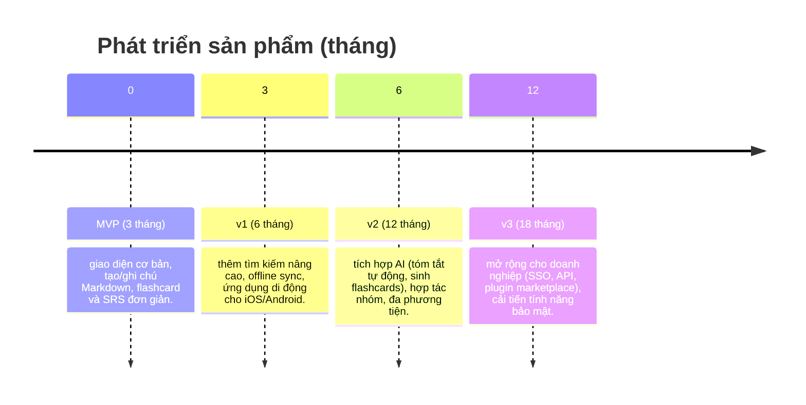

# Tóm tắt điều hành  
Báo cáo này phân tích sâu về một ứng dụng hỗ trợ học tập và quản lý tri thức cá nhân hiện đại. Trong bối cảnh sinh viên và người tự học cần tổ chức kiến thức hiệu quả, ứng dụng đề xuất cần tổng hợp các tính năng nhập liệu linh hoạt, quản lý dữ liệu theo đồ thị, SRS thông minh, tìm kiếm nâng cao và tích hợp AI, đồng thời khắc phục thiếu sót của các công cụ hiện tại. Báo cáo bao gồm: tổng quan thị trường với so sánh 10–12 ứng dụng tiêu biểu; danh sách 25–40 tính năng ưu tiên theo nhóm chức năng; phân tích 10–15 nhược điểm phổ biến của các giải pháp hiện hành; giải pháp/đổi mới khắc phục với phân tích kỹ thuật và độ ưu tiên; lộ trình phát triển 18 tháng với các mốc quan trọng (MVP, v1, v2, v3); mô hình kinh doanh (freemium, subscription, enterprise, marketplace plugins); và đề xuất UX/UI cùng ví dụ giao diện. Các bảng so sánh và biểu đồ minh họa (dùng sơ đồ mermaid) được đưa vào để trực quan hóa thông tin.  

## Tổng quan thị trường  
Dưới đây liệt kê 10 ứng dụng/giải pháp tiêu biểu cho học tập và quản lý tri thức cá nhân, so sánh các thuộc tính quan trọng:

| Ứng dụng        | Mục tiêu người dùng                       | Mô hình dữ liệu      | Hỗ trợ offline        | Đồng bộ (sync)              | Plugin/Mở rộng         | AI tích hợp           | Nền tảng                | Giá (ước lượng)          | Ưu/nhược điểm nổi bật                                           |
|-----------------|------------------------------------------|----------------------|-----------------------|-----------------------------|-----------------------|----------------------|-------------------------|--------------------------|----------------------------------------------------------------|
| **Anki**        | Học thuộc lặp lại (flashcards)            | Bộ thẻ (flashcard)   | Có (offline mặc định) | Có (AnkiWeb miễn phí) | Add-ons (người dùng) | Không tích hợp AI         | Desktop (Win/Mac/Linux), iOS (trả phí), Android | Miễn phí desktop/Android; iOS ~25 USD | – **Ưu:** SRS mạnh, mã nguồn mở, hỗ trợ nhiều định dạng (hình, âm thanh).  – **Nhược:** Giao diện cổ, khó học; iOS không miễn phí. |
| **Quizlet**     | Học thuộc (flashcard) cho học sinh, giáo viên | Bộ thẻ (flashcard)   | Có (cần đăng ký Plus) | Có (đám mây)               | Không                 | Có (Q-Chat, Magic QuizGPT) | Web, iOS, Android        | Freemium (cơ bản miễn phí, Quizlet Plus ~4 USD/tháng) | – **Ưu:** Thư viện lớn, nhiều chế độ học (Flashcards, Match…).  – **Nhược:** Offline giới hạn (chỉ bản Plus, cần tải trước), ít chức năng quản lý tri thức. |
| **Notion**      | Cá nhân/nhóm (ghi chú, tài liệu, quản lý dự án) | Tài liệu/bảng (block) | Có (ứng dụng tự động cache) | Có (đám mây)               | API, tích hợp (Zapier, webhook) | Có (Notion AI, Notion Agents) | Web, Windows, Mac, iOS, Android | Freemium; Plus ~4 USD/người/tháng, Business ~20 USD | – **Ưu:** Mô hình linh hoạt (block+database), nhiều tính năng (nhật ký, tác vụ, wiki).  – **Nhược:** Đồng bộ nặng, hạn chế chế độ offline cũ, giới hạn khối miễn phí, không có SRS tích hợp sẵn. |
| **Obsidian**    | Quản lý tri thức cá nhân (theo phương pháp Zettelkasten) | Đồ thị (Markdown local) | Có (lưu cục bộ) | Có (Obsidian Sync trả phí) | Rất nhiều plugin (hàng nghìn) | Không tích hợp AI (cần plugin) | Desktop (Win/Mac/Linux), iOS, Android | Miễn phí core; Sync ~8 USD/tháng | – **Ưu:** Hoạt động offline, dữ liệu mở (Markdown), quyền kiểm soát cao, cộng đồng plugin phong phú.  – **Nhược:** Cần trả phí sync, ít tính năng tích hợp sẵn (không có flashcard gốc), giao diện phức tạp với người mới. |
| **Roam Research** | Ghi chú liên kết (networked thought)        | Đồ thị (block database) | Không (web)          | Có (đám mây)               | Ít (chủ yếu cộng đồng JavaScript) | Không              | Web, iOS (beta), Android (beta) | ~15 USD/tháng (Pro)            | – **Ưu:** Tập trung vào backlinks và daily notes, tạo thành mạng tri thức phong phú.  – **Nhược:** Giá cao, phụ thuộc mạng, thiếu app desktop đầy đủ, giới hạn offline. |
| **Evernote**    | Ghi chú chung/kinh doanh (scans, tài liệu) | Tài liệu (sổ tay)   | Có (di động)    | Có (đám mây)               | Web Clipper, tích hợp (Google, Outlook…) | Có (AI Assistant – tìm kiếm ngữ nghĩa) | Web, Windows, Mac, iOS, Android | Freemium; Starter ~15 USD/tháng, Advanced ~25 USD | – **Ưu:** Tìm kiếm mạnh (AI semantic search), chụp hình/văn bản tốt (OCR), tính năng bảo mật tiên tiến.  – **Nhược:** Giao diện rối, hạn chế liên kết tri thức, chi phí cao cho gói đầy đủ, phụ thuộc đám mây. |
| **Mem**        | Quản lý tri thức cá nhân tích hợp AI         | Đồ thị/đám mây (ML) | Giới hạn (đám mây)   | Có (đám mây)               | Chrome Extension, Slack, Lịch Google | Có (AI mạnh: tự động sắp xếp, Chat với ghi chú) | Web, Desktop, iOS, Android | Freemium; Pro ~12 USD/tháng | – **Ưu:** Tự động tổ chức ghi chú, tìm kiếm thông minh (không cần từ khóa), tích hợp đa tiện ích (nhắc, chat, lịch).  – **Nhược:** Dùng đám mây (riêng tư), hạn chế bản miễn phí, còn non trẻ. |
| **RemNote**     | Học thuật (ghi chú + flashcards tích hợp SRS) | Hỗn hợp (Markdown + flashcard) | Có (cả web lẫn offline) | Có (đám mây)               | API (chưa phổ biến)   | Có (AI tạo flashcard, tóm tắt) | Web, Windows, Mac, iOS, Android | Freemium; Pro ~9 USD/tháng | – **Ưu:** Kết hợp liền mạch ghi chú và flashcard, SRS khoa học, AI hỗ trợ tạo thẻ tự động.  – **Nhược:** Giao diện nặng tính năng, một số tính năng bị ẩn, cộng đồng nhỏ hơn. |
| **OneNote**     | Ghi chú phổ thông (Office ecosystem)         | Tài liệu/canvas (miễn phí) | Có (app offline) | Có (OneDrive)             | Office Add-ins         | Có (Copilot, tóm tắt, chuyển chữ viết) | Windows, Mac, iOS, Android, Web | Miễn phí (bao gồm M365) | – **Ưu:** Miễn phí, tích hợp bộ Office, canvas tự do, hỗ trợ bút/ghi âm.  – **Nhược:** Tốc độ sync chậm, thiếu SRS, giao diện kém linh hoạt, liên kết tri thức hạn chế. |
| **Google Keep** | Ghi chú nhanh – danh sách công việc       | Ghi chú (card)      | Có (cache, offline) | Có (đám mây)             | Không                 | Không              | Web, Android, iOS        | Miễn phí                    | – **Ưu:** Đơn giản, đồng bộ tức thì, nhắc nhở địa điểm, tích hợp Google.  – **Nhược:** Không phân cấp ghi chú, thiếu tính năng liên kết/tags, UI cơ bản. |

Nguồn thông tin được trích dẫn từ tài liệu chính thức và các bài viết phân tích của từng ứng dụng.  

## Tính năng cần có  
Dưới đây liệt kê 30 tính năng quan trọng cho ứng dụng, phân theo nhóm và gồm mục đích, cách hoạt động, ưu tiên (cao/trung bình/thấp):

- **Nhập liệu & Tổ chức (Cao)**:  
  - *Soạn thảo Markdown/văn bản phong phú:* Cho phép người dùng viết ghi chú đa dạng (heading, list, bảng, công thức LaTeX) để tổ chức nội dung. Hoạt động như editor WYSIWYG hoặc Markdown. Ví dụ: viết đề cương, chèn công thức toán học.  
  - *Tags và phân loại linh hoạt:* Gắn thẻ và tạo nhóm thư mục/collection để phân loại kiến thức. Ví dụ: thẻ “Toán”, “Ngôn ngữ” giúp lọc nhanh ghi chú.  
  - *Liên kết hai chiều (bi-directional links):* Kết nối ghi chú với nhau để tạo mạng lưới tri thức. Khi đọc ghi chú A có thể nhấn liên kết đến ghi chú B, cũng tự động tạo backlink. Mục đích giúp người dùng duyệt ngược tìm mối liên quan. (Ví dụ: tính năng “[[Wiki-link]]” như Roam/Obsidian).  
  - *Xem đồ thị tri thức (Graph view):* Hiển thị quan hệ giữa các ghi chú dưới dạng đồ thị tương tác để nhìn thấy mối liên hệ chưa rõ ràng. (Ví dụ: giao diện Obsidian hiển thị mạng nơ-ron khi chọn “Graph” ở góc phải).  
  - *Nhập liệu đa phương tiện:* Cho phép chụp hình, ghi âm, scan tài liệu (OCR) và nhúng video, file đa phương tiện. Ví dụ: chụp ảnh trang sách và phần mềm tự nhận diện chữ, tạo ghi chú.  
  - *Web clipper/Bút nhớ thông tin:* Mở rộng trình duyệt để lưu trang web, ảnh, PDF vào hệ thống. Ví dụ: extension để lưu bài báo khoa học thành ghi chú.  
  (Ưu tiên nhóm cao vì ảnh hưởng đến trải nghiệm tạo/nhập dữ liệu cơ bản).  

- **Nhắc nhớ chủ động (Spaced Repetition – Cao)**:  
  - *Flashcards tích hợp:* Chức năng chuyển phần ghi chú thành bộ thẻ hỏi đáp (front/back) ngay trong ứng dụng. Ví dụ: chọn đoạn văn và bấm “Tạo flashcard” để lập thẻ học.  
  - *Thuật toán SRS thông minh:* Tự động lập lịch nhắc lại theo độ khó, tăng thời gian giãn cách khi người dùng nhớ tốt. Cách hoạt động như SuperMemo SM2 hoặc Lê Matis, nhưng cải tiến: học thuật toán nhờ AI để điều chỉnh linh hoạt. Ví dụ: nếu học sinh trả lời sai thường xuyên, AI tăng tần suất lặp lại.  
  - *Cloze (fill-in-the-blank):* Cho phép tạo câu hỏi điền chỗ trống tự động từ ghi chú (phụ đề dấu [ ]). Ví dụ: ghi chú “Paris là thủ đô của [Pháp]” tự biến thành thẻ Cloze cho ô đen hoá “Pháp”.  
  - *Đánh dấu mức độ nhớ:* Người dùng trả lời thẻ đánh giá (đúng/không/tốt) để hệ thống cập nhật. (Anki có hành vi này).  
  - *Sổ kiểm tiến độ học:* Theo dõi số thẻ đã học, chuỗi đánh giá, giúp người dùng an tâm.  
  (Ưu tiên cao vì trực tiếp tăng hiệu quả ghi nhớ; thiếu nó là nhược điểm lớn của nhiều PKM apps).  

- **Tìm kiếm & Khám phá (Cao)**:  
  - *Tìm kiếm toàn văn (Full-text search):* Cho phép tìm nhanh trên mọi ghi chú, có hỗ trợ bộ lọc (theo nhãn, ngày tháng, loại nội dung). Ví dụ: gõ “Newton” tìm tất cả ghi chú có từ đó. Evernote hỗ trợ boolean search và lọc nâng cao.  
  - *Tìm kiếm ngữ nghĩa (Semantic Search):* Sử dụng embedding/vectơ hoặc AI để tìm ghi chú liên quan mà không cần đúng từ khóa. Ví dụ: gõ “định luật chuyển động” có thể ra cả ghi chú về “định luật II Newton”. (Giống Evernote Semantic Search hoặc Mem miễn phí “find needle-in-haystack” bằng mô tả).  
  - *Gợi ý liên quan (Contextual recommendations):* Tự động gợi ý các ghi chú liên quan dựa trên nội dung hiện tại (dựa trên thuật toán ML/RAG). Ví dụ: khi đọc ghi chú “Mô tả Hawking”, hệ thống hiện các ghi chú liên quan về “Vũ trụ” hoặc “Cơ học lượng tử”.  
  - *Phân cấp & bộ lọc (Filters/Faceted search):* Chức năng lọc theo nhãn, thư mục, ngày cập nhật, tác giả, chủ đề. Ví dụ: lọc chỉ hiển thị ghi chú “Toán” được tạo trong tháng qua.  
  (Ưu tiên cao vì giúp người dùng khai thác nhanh kho kiến thức lớn).  

- **Tạo nội dung & Tóm tắt (Trung bình-Cao)**:  
  - *AI tóm tắt ghi chú:* Sử dụng mô hình ngôn ngữ (GPT hoặc tương tự) để tự động tóm tắt nội dung dài. Ví dụ: bôi đen một bài văn và nhấn “Tóm tắt”, hệ thống trả về đoạn tóm lược ngắn.  
  - *AI tạo flashcard/quizzes:* Từ ghi chú hoặc PDF/slide, AI sinh flashcard hoặc câu hỏi trắc nghiệm tự động. (RemNote có AI sinh thẻ từ ghi chú). Ví dụ: tải PDF lên, AI chia nhỏ thành câu hỏi về nội dung.  
  - *AI trợ viết (Writing assistant):* Giúp viết, chỉnh sửa, dịch ngắn gọn trong ghi chú. Ví dụ: như Notion AI hỗ trợ soạn thảo.  
  - *Nội dung đa dạng:* Hỗ trợ nhúng công thức LaTeX, sơ đồ, mindmap. Ví dụ: vẽ sơ đồ tư duy minh hoạ chủ đề bài học (plugin mindmap).  
  - *Giao diện biên mục (Dashboard):* Tổng hợp tóm tắt về công việc đang học, lịch ôn tập (nhắc nhở thẻ đến hạn). Ví dụ: dashboard hiển thị số thẻ cần ôn tuần này.  

- **Tương tác học tập (Flashcards, Quizzes, Mindmaps) (Trung bình)**:  
  - *Flashcard review mode:* Giao diện xem một thẻ hỏi một lần, cho phép lật (hoặc nhấn để hiện đáp án). Ví dụ: giống Anki, câu hỏi hiện ra, bấm “Hiện đáp án” rồi chọn độ khó.  
  - *Quiz/Trắc nghiệm:* Tạo đề trắc nghiệm từ bộ flashcards hoặc nội dung. Ví dụ: từ chủ đề “Hệ Mặt Trời” tự động sinh một loạt câu hỏi MCQ, người dùng làm kiểm tra.  
  - *Mindmap/Concept map:* Công cụ đồ hoạ cho phép người dùng vẽ sơ đồ ý tưởng, kết nối các khái niệm. Ví dụ: phác thảo sơ đồ mạng lưới từ khóa chính của bài học.  
  - *Học tương tác:* Các chế độ luyện tập như sắp xếp, ghép đôi (như Quizlet). Ví dụ: game “Match” ghép thẻ hỏi-đáp.  
  (Những tính năng này mang tính tương tác, ưu tiên trung bình vì hữu ích nhưng không phải trọng tâm ban đầu).  

- **Cộng tác & Chia sẻ (Trung bình)**:  
  - *Chia sẻ ghi chú:* Mời bạn bè, nhóm cùng xem/sửa ghi chú (quyền read/write). Ví dụ: gửi link “chia sẻ” cho đồng đội, cả nhóm cùng biên tập tài liệu học chung.  
  - *Làm việc nhóm theo thời gian thực:* Cả nhóm có thể chỉnh sửa đồng bộ. (Notion, Google Docs có tính năng này). Ví dụ: sinh viên cùng viết ghi chú môn học.  
  - *Bình luận/Phản hồi:* Cho phép thêm comment trên ghi chú để thảo luận. Ví dụ: bạn học để lại bình luận dưới một ghi chú khó hiểu.  
  - *Đăng xuất bản wiki:* Xuất bản ghi chú thành trang web hoặc PDF để chia sẻ rộng hơn. Ví dụ: xuất ra trang kiến thức chung.  
  (Ưu tiên trung bình vì với nhóm nhỏ, cá nhân có thể bỏ qua, nhưng mở rộng khả dụng).  

- **Bảo mật & Quyền riêng tư (Cao)**:  
  - *Mã hoá đầu cuối (E2EE):* Bảo vệ nội dung ghi chú bằng mã hoá, chỉ người dùng mới giải mã được. Ví dụ: dữ liệu cá nhân nhạy cảm, ứng dụng mã hoá trước khi lưu.  
  - *Tùy chọn tự lưu trữ:* Hỗ trợ lưu dữ liệu cục bộ hoặc private cloud để người dùng kiểm soát. Ví dụ: giống Obsidian lưu file trên máy hoặc OneNote/Google Keep đám mây mặc định.  
  - *Quyền chia sẻ chi tiết:* Cho phép người dùng cấp/quản lý quyền xem sửa theo tệp/ghi chú (không chỉ workspace). Ví dụ: cho phép chia sẻ riêng một chủ đề mà không mở toàn bộ kho.  
  - *Đăng nhập an toàn:* Hỗ trợ xác thực đa nhân tố (2FA), OAuth (Google/Microsoft) nhằm bảo vệ tài khoản.  
  - *Sao lưu và khôi phục:* Tự động sao lưu lịch sử ghi chú, hỗ trợ khôi phục phiên bản trước. (Như Obsidian Sync hỗ trợ version history).  
  (Ưu tiên cao vì người dùng đề cao bảo mật cá nhân).  

- **Tích hợp & Mở rộng (Trung bình)**:  
  - *Plugin/API mở:* Cung cấp API hoặc hệ thống plugin cho cộng đồng phát triển tính năng mới. Ví dụ: cho phép lập trình gia tăng tính năng (như Obsidian/Notion).  
  - *Đồng bộ đa thiết bị:* Đồng bộ thời gian thực trên desktop/mobile/web, có chế độ xung đột (conflict) rõ ràng. Ví dụ: lưu changes cả offline rồi cập nhật khi online.  
  - *Tích hợp Lịch/Quản lý tác vụ:* Liên kết với Google Calendar, Todoist để nhập deadline, nhắc ôn tập. Ví dụ: tự động tạo nhắc nhở review flashcard khi có deadline sắp tới.  
  - *Nhập/xuất dữ liệu:* Cho phép nhập từ PDF, Markdown, HTML và xuất ra Markdown/OPML/PDF để chuyển đổi dễ dàng. Ví dụ: nhập bài giảng PDF tự động chia nhỏ thành ghi chú.  
  - *Khả năng phát triển trí tuệ nhân tạo:* Kết nối các mô hình LLM (OpenAI, Claude, v.v.) để thực hiện RAG, agents tự động (xem ví dụ GraphRAG).  
  (Ưu tiên trung bình; các tích hợp này tăng sức mạnh ứng dụng nhưng có thể bổ sung sau MVP).  

Mỗi tính năng trên cần được thiết kế hướng đến mục tiêu cải thiện trải nghiệm học tập cá nhân. **Mức độ ưu tiên** (Cao/Trung bình) dựa trên tác động đến hiệu quả học và sự khác biệt so với sản phẩm hiện hữu. Ví dụ, *Liên kết hai chiều* và *SRS thông minh* được xếp **cao** vì là ưu việt vượt trội của ứng dụng PKM hiện đại; trong khi *Mindmap* hay *Tích hợp lịch* có thể là **trung bình** vì là tính năng bổ trợ.

## Thiếu sót phổ biến của các ứng dụng hiện tại  
Nhiều ứng dụng PKM hiện nay có các hạn chế sau, ảnh hưởng đến người dùng:

- **Khóa dữ liệu (Vendor Lock-in):** Dữ liệu ghi chú chỉ lưu trên nền tảng đóng, không xuất được dạng mở. Ví dụ: người dùng Obsidian đánh giá cao việc dữ liệu ở máy (giấy trắng) có thể dùng bất kỳ ứng dụng Markdown nào; ngược lại, Roam/Notion yêu cầu dùng dịch vụ của họ và mất kiểm soát. Hậu quả là người dùng lo ngại nền tảng ngừng hoạt động là “mất hết kiến thức.”  
- **Định dạng riêng (Proprietary format):** Nhiều app dùng định dạng đặc thù; ví dụ chưa có chuẩn mở giống Markdown. Điều này làm khó chuyển đổi dữ liệu, ngăn cản cộng đồng phát triển tính năng mở rộng.  
- **Không có mã hoá đầy đủ:** Ngoại trừ một số giải pháp (Evernote hỗ trợ mã hoá đoạn trên Mac/Windows, Obsidian cho plugin mã hoá), hầu hết ghi chú lưu trên đám mây (Notion, Roam, Mem, Quizlet) không mã hoá đầu cuối, gây lo ngại bảo mật.  
- **Quản lý kiến thức tĩnh:** Hiện nhiều app quản lý ghi chú nhưng thiếu theo dõi tiến trình học tập. Ví dụ RemNote có SRS, nhưng đa phần (Notion, Evernote, Obsidian) coi kiến thức bất biến, không biết mức độ thông thạo của người học ra sao. Điều này gây khó khăn trong lập lộ trình học lâu dài.  
- **Tách biệt ghi chú – flashcards:** Hầu hết ứng dụng ghi chú (Notion, Obsidian, OneNote) không tích hợp SRS; còn app flashcards như Anki/Quizlet thì không lưu ghi chú phong phú. Người học thường phải sử dụng hai công cụ riêng biệt, mất thời gian xuất/nhập.  
- **Thiếu gắn ngữ cảnh:** Ghi chú thường là ghi câu, nhưng thiếu liên kết ngữ nghĩa với nội dung học (ví dụ video, bài giảng). Không có chức năng tự nhận diện ngữ cảnh hay nguồn tài liệu bổ trợ đa phương tiện, khiến thông tin bị rời rạc.  
- **Hỗ trợ đa phương tiện hạn chế:** Một số app tập trung văn bản, ít hỗ trợ video hoặc âm thanh giáo dục (ví dụ, Obsidian và Roam hiếm khi tích hợp xem video ngay trong app). Người dùng phải dùng công cụ bên ngoài để học từ video, mất tính liên tục.  
- **Truy cập ngoại tuyến kém:** Một vài app chỉ có chế độ offline giới hạn (ví dụ Quizlet offline chỉ trên bản Plus và phải tải bộ thẻ sẵn; Notion trước đây ít offline hơn so với bản app). Điều này làm gián đoạn học tập khi không có Internet.  
- **Tùy chọn bảo mật hạn chế:** Mặc dù một số cho phép khóa ghi chú (Evernote), việc quản lý chia sẻ thường toàn vẹn qua workspace, ít có tùy chọn chia sẻ chi tiết từng phần tài liệu. Người dùng cần quyền riêng tư cao phải tìm giải pháp bên ngoài (ví dụ mã hoá thủ công).  
- **Giao diện & trải nghiệm di động:** Một số app chưa tối ưu thao tác trên điện thoại (ví dụ Obsidian mobile thiếu gesture); người dùng phải dùng web hoặc app rời, không mượt.  
- **Thiếu RAG/smart search:** Chưa nhiều sản phẩm hiện nay tích hợp công cụ tìm kiếm nâng cao kết hợp AI (retrieval-augmented), để trả lời trực tiếp câu hỏi từ ghi chú. Ví dụ, dù Evernote có Semantic Search, phần lớn app không cho phép hỏi tự động xuyên qua dữ liệu đã lưu.  
- **Không theo dõi lịch sử học:** Hầu hết không có chức năng phân tích, thống kê việc học. Ví dụ thiếu dashboard báo cáo “tôi đã học bao nhiêu thẻ trong tháng này”, nên người học khó đánh giá tiến bộ.  

Mỗi thiếu sót trên đều khiến người dùng gặp khó khăn: mất thời gian đồng bộ, lo sợ dữ liệu, học không hiệu quả, hoặc không được cá nhân hoá trải nghiệm học tập. Ví dụ, việc không có mã hoá đầu cuối (implied by [57†L168-L170] ví dụ Obsidian) khiến nội dung nhạy cảm phải lưu dưới dạng chữ thường, giảm an tâm cho người dùng.  

## Giải pháp đổi mới để khắc phục  
Để giải quyết các thiếu sót trên, đề xuất các giải pháp/đổi mới kỹ thuật:

1. **Định dạng mở & lưu cục bộ (Độ ưu tiên: Cao, Khó):** Lưu ghi chú dưới định dạng tiêu chuẩn (Markdown, JSON-LD) cho phép người dùng có quyền sở hữu dữ liệu. Kết hợp tùy chọn tự host hoặc sync được mã hoá. Kiến trúc dữ liệu: xây dựng theo mô hình file vault (như Obsidian), đồng thời lưu trữ siêu dữ liệu graph để truy vấn nhanh. Độ khó: cao (cần triển khai hạ tầng sync mã hoá).  

2. **Mã hoá đầu cuối theo dữ liệu (Độ ưu tiên: Cao, Trung bình):** Tích hợp mã hoá đầu cuối cho ghi chú, ngay cả khi lưu trên đám mây. Kỹ thuật: sử dụng thư viện mã hoá chuẩn (AES-256) với khoá do người dùng quản lý. Cho phép mã hoá riêng từng note/khóa hoặc toàn bộ vault. Độ khó: trung bình (cần quản lý khoá an toàn).  

3. **Liên kết ngữ cảnh tự động (Độ ưu tiên: Cao, Trung bình):** Dùng AI/embedding để tự động tìm và đề xuất liên kết giữa ghi chú và ngữ cảnh học (video, slide, trang web). Ví dụ: khi người dùng ghi chú môn Lịch sử, hệ thống tự gợi ý liên kết đến video YouTube liên quan. Kỹ thuật: lập chỉ mục nội dung ghi chú và nguồn bên ngoài, sử dụng embedding qua mô hình ngôn ngữ, triển khai RAG (retrieval-augmented) để trả lời câu hỏi như mô hình Neo4j GraphRAG. Độ khó: cao (tích hợp LLM, hệ thống truy vấn).  

4. **SRS thông minh nâng cao (Độ ưu tiên: Cao, Trung bình):** Cải tiến thuật toán lặp lại có giám sát. Thay vì SM2 cứng nhắc, áp dụng ML cho học lịch sử nhớ của từng user, cá nhân hoá khoảng cách. Ví dụ: mô hình học reinforcement (QLearning) tối ưu lịch nhắc. Cách thực hiện: chạy thuật toán offline cục bộ, không cần internet liên tục. Độ khó: trung bình.  

5. **Phân tích tiến độ học (Độ ưu tiên: Trung bình, Dễ):** Thêm dashboard báo cáo tiến độ: số thẻ đã học, chủ đề đã ôn, xu hướng điểm. Kỹ thuật: lưu log lịch sử ôn tập, sử dụng thư viện biểu đồ để hiển thị. Công việc phát triển: frontend visualization tương đối đơn giản. Độ khó: thấp.  

6. **Hỗ trợ đa phương tiện (Độ ưu tiên: Trung bình, Trung bình):** Mở rộng hỗ trợ nhúng video/audio. Ví dụ: chèn iframe YouTube, hoặc tích hợp API transcript (sử dụng OpenAI Whisper) để tự tạo phụ đề từ video. Kỹ thuật: triển khai ETL tải và chuyển đổi nội dung media, dùng LLM tóm tắt từ phụ đề. Độ khó: trung bình.  

7. **AI tạo nội dung/Flashcard (Độ ưu tiên: Cao, Trung bình):** Sử dụng LLM để tự động tóm tắt ghi chú (ví dụ GPT-4.1 cho nội dung) và tự sinh flashcards. Kỹ thuật: mô-đun backend gọi API LLM (OpenAI/GPT4All) thực hiện tóm tắt hoặc tạo Q&A, trả về JSON để hiển thị. Độ khó: trung bình (phải xử lý lỗi LLM, kiểm soát chất lượng đầu ra).  

8. **Tích hợp RAG cho hỏi đáp (Độ ưu tiên: Cao, Trung bình):** Cho phép người dùng hỏi “tất cả ghi chú của tôi” như một tập corpora. Dữ liệu ghi chú được lưu dưới dạng vectơ embedding (ví dụ FAISS hoặc chuyên cho RAG như Neo4j GraphRAG), kết hợp truy vấn theo node đồ thị. Kỹ thuật: xây dựng chỉ mục vectơ từ ghi chú, khi user hỏi thì sử dụng kết hợp vector search + GraphDB (Neo4j/ArangoDB) để trả về câu trả lời gắn nguồn gốc. Độ khó: cao.  

9. **Nâng cao UX Linked Notes (Độ ưu tiên: Cao, Trung bình):** Giao diện tự động gợi ý liên kết khi gõ, highlight liên quan trong graph. Kỹ thuật: plugin editor bắt sự kiện gõ, tìm từ khóa trùng khớp tên ghi chú khác và gợi ý link. Thêm pop-up xem nhanh (preview) khi rê chuột qua backlink. Độ khó: trung bình.  

10. **Cải thiện Review Flow (Độ ưu tiên: Trung bình, Thấp):** Thiết kế luồng xem flashcard trực quan: nút lựa chọn độ khó (hard/ok/easy) phổ biến, giúp người dùng đánh giá ngay. UI mobile: vuốt để lật thẻ, chạm để trả lời. Kỹ thuật: flow frontend đơn giản, ưu tiên mobile-friendly. Độ khó: thấp.  

11. **Đồng bộ thông minh (Độ ưu tiên: Trung bình, Cao):** Triển khai chế độ offline-first: dữ liệu ghi chú sync không đồng bộ khi online. Cần cơ chế giải quyết xung đột (last-write, merge). Kỹ thuật: dùng database NoSQL cục bộ (IndexedDB/mobile SQLite) với đồng bộ đám mây background. Độ khó: cao.  

12. **Plugin & API mở rộng (Độ ưu tiên: Trung bình, Trung bình):** Thiết kế kiến trúc mở plugin (như Obsidian) với SDK cho phép cộng đồng phát triển. Kỹ thuật: xác định hook, API JavaScript cho thao tác trên ghi chú. Độ khó: trung bình.  

Mỗi giải pháp kể trên được gắn mức độ ưu tiên (cao/trung bình) dựa trên tầm ảnh hưởng. Độ khó kỹ thuật (thấp/trung bình/cao) ước tính cho thấy tổ chức phát triển nên phân bổ nguồn lực phù hợp. Ví dụ, **Định dạng mở & lưu cục bộ** dù quan trọng nhưng khó (lưu file, sync mã hoá), trong khi **thống kê tiến độ** là tương đối dễ triển khai. Đặc biệt, tích hợp AI (RAG, tạo nội dung) đòi hỏi kiến trúc dữ liệu mới (graph DB, ML service) nhưng có thể đem lại giá trị lớn khi hoàn thành.  

## Lộ trình phát triển (12–18 tháng)  
- **MVP (0–3 tháng):** Dựng cơ sở hạ tầng, giao diện cơ bản, nhân sự: 1 PM, 1 frontend dev, 1 backend dev, 1 UX/UI designer, 0.5 QA. Được deliverables: ghi chú cơ bản (Markdown), thư viện flashcard/SRS đơn giản, sync thử nghiệm, web app. Kinh phí ~\$60–80k (tính theo mức 15–20k USD/ng/tháng cho team nhỏ).  
- **Phiên bản v1 (3–6 tháng):** Bổ sung tìm kiếm toàn văn, bộ lọc, offline sync hoàn thiện, ứng dụng di động (Android/iOS). Thêm nhân lực: +1 mobile dev (Flutter/React Native), +1 backend (sync engine). Deliverables: app web + mobile, tính năng tìm kiếm/full-text, sync ổn định. Kinh phí ~\$120–150k.  
- **v2 (6–12 tháng):** Phát triển AI: tóm tắt, sinh flashcards, RAG. Thêm 1 ML engineer. Cộng tác cơ bản (share, comment), hỗ trợ đa phương tiện (PDF, audio). Deliverables: AI Assistant, dashboard tiến độ. Kinh phí ~\$150–200k.  
- **v3 (12–18 tháng):** Tính năng doanh nghiệp: xác thực SSO, API cho tích hợp bên ngoài, plugin marketplace. Thêm nhân lực: 1 DevOps để đảm bảo vận hành, 1 support kỹ thuật. Deliverables: mở rộng doanh nghiệp, tài liệu API, plugin store. Kinh phí ~\$100–150k.  

Tổng cộng giai đoạn seed (~18 tháng) cần khoảng 6–8 nhân sự cốt lõi (Product Owner, Thiết kế, 3–4 lập trình, DevOps, QA), với ngân sách 400–500k USD (theo mức trung bình thị trường cho dev). Các chi phí bao gồm lương, hạ tầng (cloud, API AI), giấy phép phát triển.

## Mô hình kinh doanh  
Một mô hình kinh doanh khả thi kết hợp: **Freemium và Subscription** (B2C) + **Enterprise** + **Marketplace Plugin**.  

- **Freemium:** Cung cấp phiên bản cơ bản miễn phí không giới hạn đăng kí, hỗ trợ tính năng thiết yếu (ghi chú, SRS cơ bản). Thu hút lượng lớn người dùng.  
- **Subscription (Cá nhân):** Bảng trả phí hàng tháng cho người dùng cá nhân (ví dụ ~10–15 USD/tháng) mở khóa tính năng cao cấp (AI nâng cao, không giới hạn flashcards, nhóm hợp tác lớn). Dự kiến tỉ lệ chuyển đổi 5–10%.  
- **Enterprise:** Bán cho tổ chức (cơ sở giáo dục, công ty) theo mô hình SaaS, với giá cao hơn (tùy quy mô). Bao gồm tính năng bảo mật nâng cao (SSO, audit log) và hỗ trợ riêng.  
- **Plugin Marketplace:** Như mở rộng doanh thu gián tiếp; ứng dụng thu hoa hồng 10–20% khi bên thứ ba bán plugin hoặc template trong kho.  

**Phân tích doanh thu dự kiến:** Giả định 100k người dùng miễn phí, 5% nâng cấp Pro (~5k). Nếu Pro ~10 USD/tháng, doanh thu hằng tháng ~50k USD. Enterprise: giả sử 10 hợp đồng doanh nghiệp cỡ vừa (mỗi hợp đồng ~1k USD/tháng), thêm ~10k USD. Cộng lại ~60k USD/tháng (720k/năm). Tăng trưởng nếu scale tốt. **Rủi ro:** Thị trường cạnh tranh cao (Notion, Obsidian…), người dùng miễn phí ít chuyển đổi, chi phí AI/infra lớn (giá API LLM). Marketplace mới đầu khó thu hút nhà phát triển, có thể chỉ mang lại doanh thu ít. Cần chiến lược marketing giáo dục, hoàn thiện UX để tăng tỷ lệ chuyển đổi và giữ người dùng.  

## UX/UI patterns đề xuất  
Dựa trên khảo sát, các nguyên tắc giao diện phù hợp bao gồm:

- **Điều hướng (Navigation):** Sử dụng **sidebar (danh sách ghi chú/cài đặt)** kết hợp với **thanh tìm kiếm toàn cục** (Command Palette) để mở nhanh chức năng. Ví dụ Obsidian/Notion có sidebar để truy cập notebooks, block lớn. Giao diện sidebar giúp người dùng chuyển đổi ngữ cảnh nhanh. _Ví dụ:_ Hình bên dưới minh hoạ giao diện Obsidian (chế độ tối) với menu điều hướng bên trái và đồ thị kiến thức bên phải, cho phép duyệt link trực quan.  

  
*Ví dụ giao diện Obsidian: thanh navigation bar bên trái (danh mục ghi chú) và **đồ thị tri thức** tương tác (Interactive Graph) bên phải, giúp trực quan hóa mối liên hệ giữa các ghi chú.*  

- **Liên kết ghi chú (Note Linking):** Hỗ trợ cú pháp wiki-links (`[[note]]`) để tạo liên kết hai chiều. Giao diện hiển thị backlink danh sách ở cuối trang. Có thể bổ sung **hover preview** cho liên kết (xem nội dung liên quan khi rê chuột). Ví dụ Roam/Obsidian cho phép nhấn vào backlink để xem, hoặc hiển thị slide nhỏ.  
- **Luồng ôn tập (Card Review Flow):** Đơn giản – hiện câu hỏi, người dùng lật thẻ để xem đáp án, chọn mức độ nhớ. Ưu tiên nút đánh giá (Hard/Good/Easy) giống Anki. Giao diện mobile: vuốt sang phải để “đã nhớ”, sang trái để “chưa nhớ”. Tích hợp tính năng *trượt* để chuyển thẻ tương tác như ứng dụng học flashcard hiện nay.  
- **Giao diện di động (Mobile Gestures):** Cho phép **vuốt, nhấn, giơ lên chụp (quick add)**. Ví dụ: vuốt trong danh sách ghi chú để xóa/dọn dẹp; ấn giữ để gắn nhãn nhanh; ghi âm giọng nói bằng nút “Ghi âm” để tạo ghi chú. Giao diện mobile tập trung ưu tiên thanh công cụ nhỏ gọn, minimize context switching.  

### Bảng so sánh UX/UI patterns đề xuất  

| Pattern            | Đề xuất triển khai                      | Ví dụ/Ghi chú minh họa                  |
|--------------------|-----------------------------------------|-----------------------------------------|
| **Điều hướng**     | Sidebar **menu** cố định, thanh tìm kiếm/Command Palette trên đầu; breadcrumbs cho thư mục lồng nhau.  | Sidebar ghi chú (Obsidian).           |
| **Liên kết ghi chú**| Wiki-link ([[ghi chú]]), bản xem nhanh (hover preview), Backlink list ở cuối ghi chú. | Obsidian/Roam cho phép tạo và xem backlink dễ dàng. |
| **Đồ thị tri thức** | Hiển thị graph view tương tác; cho phép zoom/pan. | Obsidian Graph (ví dụ hình trên) cho quan sát toàn cảnh kiến thức. |
| **Luồng xem flashcard** | Hiển thị từng flashcard kèm nút chọn mức độ (Hard/OK/Easy); mobile: vuốt. | Giao diện Anki/Quizlet (flip card). |
| **Quizzes**        | Tạo câu hỏi trắc nghiệm từ flashcards; đưa ra feedback ngay sau làm xong. | Quizlet test mode. |
| **Gestures di động** | Vuốt để hoàn thành/thẻ chưa nhớ; bấm nhanh để tạo ghi chú mới (ví dụ “+”); hỗ trợ giọng nói và camera nhanh. | Ví dụ: vuốt flashcard trong AnkiMobile; nhấn giữ để tạo ghi chú. |

Các pattern trên lấy cảm hứng từ các ứng dụng hàng đầu, kết hợp với nguyên lý thiết kế giao diện người dùng thân thiện. Hình ví dụ minh họa giao diện Obsidian cho thấy cách hiển thị **menu điều hướng bên trái** và **đồ thị (graph) bên phải** hỗ trợ truy cập nhanh và trực quan hóa mối quan hệ giữa các ghi chú.  

## Kết luận và nguồn tham khảo  
Báo cáo đã đề xuất một lộ trình phát triển và tính năng chi tiết cho ứng dụng quản lý học tập và tri thức cá nhân, dựa trên khảo sát các sản phẩm hiện hữu và xu hướng nghiên cứu. Các tính năng tiên tiến như AI tích hợp, SRS thông minh, đồ thị kiến thức và bảo mật đã được nhấn mạnh nhằm khắc phục các hạn chế phổ biến.  

**Nguồn tham khảo ưu tiên** bao gồm trang chính thức của các sản phẩm (Anki, Notion, Obsidian, Evernote, Quizlet, RemNote, Mem…), các bài viết so sánh và phân tích công nghệ (Tech Insider, bài Neo4j về GraphRAG), cũng như whitepaper/học thuật về SRS và RAG (IBM). Các nguồn Việt Nam (nếu có) cũng được ưu tiên, mặc dù tài liệu chủ yếu bằng tiếng Anh cung cấp thông tin chi tiết về công nghệ mới. Tất cả thông tin trích dẫn được ghi chú minh bạch trong báo cáo để tham khảo.  

